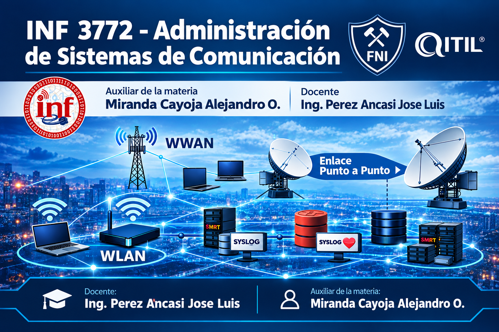

# UTO|FNI|ING.INFORMÁTICA|INF3742 
# 🏢 CASO DE ESTUDIO: Diseño e implementación de una Red Empresarial de alta disponibilidad (caso: "Universidad INF3772")

## 🎯 Objetivos del proyecto
* Diseñar e implementar una topología de red jerárquica, redundante, segura y de alta disponibilidad.
* Maximizar el aprovechamiento del espacio de direccionamiento IPv4 mediante VLSM.
* Asegurar la infraestructura en la capa de acceso y proveer conectividad perimetral controlada hacia el exterior.

> 🖼️ **Topoloía de la red**

### 🌐 Área de Borde
Punto de demarcación perimetral diseñado para gestionar la salida hacia internet y publicar servicios de la red interna:
*   **NAT Estático:** Mapeo dedicado uno a uno para permitir el acceso controlado desde el exterior a los servidores empresariales críticos.
*   **PAT (Port Address Translation):** Sobrecarga de NAT para habilitar la navegación web simultánea de los usuarios internos compartiendo una única dirección IP pública válida.
*   **Redistribución de ruta:** Ruta por default hacia redes externas, esta ruta se redistribuye mediante el protocolo de enrutamiento OSPFv2 en la red interna. 

---
### 🌐 Área de Campus 
*   **Diseño de campus:** Este proyecto se basa en el modelo jerárquico de tres niveles.
 

## 🔢 Diseño IPv4 (VLSM)
Para mitigar el desperdicio de direcciones, se segmentó el bloque base privado utilizando **VLSM**. El diseño soporta un esquema complejo de **15 VLANs** organizadas por departamentos (Datos, Voz sobre IP, Servidores, Wi-Fi, Gestión, etc.):

| ID | Departamento / Enlace | Requeridos | Disponibles | Dirección de Red | Prefijo | Primera IP Útil | Última IP Útil |
|----|-----------------------|------------|-------------|------------------|---------|-----------------|----------------|
| 1  | Servidores            | 45         | 62          | 172.16.0.0       | /26     | 172.16.0.1      | 172.16.0.62    |
| 2  | Telefonía IP          | 350        | 510         | 172.16.1.0       | /23     | 172.16.1.1      | 172.16.2.254   |
| 3  | Datos                 | 1000       | 1022        | 172.16.4.0       | /22     | 172.16.4.1      | 172.16.7.254   |
| ...| *(Ver tabla completa en Documentos/)* | ... | ... | ... | ... | ... | ... |

---

## 🛠️ Tecnologías y Protocolos Implementados

### 🔒 Conmutación y Seguridad (Capa 2)
*   **15 VLANs independientes:** Aislamiento estricto de los dominios de difusión por área operativa.
*   **802.1Q Trunking & Rapid-PVST+:** Configuración de enlaces troncales optimizados y prevención activa de bucles en la infraestructura de switches redundantes.
*   **Port Security:** Mitigación de accesos no autorizados en la capa de acceso mediante el bloqueo estricto de puertos por dirección MAC (configuración en modo *shutdown / restrict*).

### 🚀 Enrutamiento y Servicios (Capa 3)
*   **OSPFv2 (Single-Area):** Protocolo de enrutamiento dinámico interno elegido para asegurar una convergencia de red ultra rápida ante fallos en los enlaces corporativos.
*   **Inter-VLAN Routing:** Configurado a nivel de distribución mediante Interfaces Virtuales de Switch (SVI) en equipos multicapa.
*   **DHCP Server & Relay Agent:** Automatización integral en la entrega de direccionamiento y parámetros de red a los dispositivos finales.

---

## 🧪 Pruebas de Validación y Diagnóstico
El repositorio incluye archivos logs de consola que validan el comportamiento esperado de la red:
1. **Conectividad End-to-End:** Trazas exitosas de comandos `ping` y `traceroute` cruzando múltiples subredes.
2. **Bloqueo por Seguridad:** Capturas de logs de consola demostrando cómo actúa **Port Security** ante la intrusión de una dirección MAC desconocida.
3. **Tablas de Enrutamiento:** Verificación de las adyacencias OSPFv2 correctas mediante la salida del comando `show ip route`.
Usa el código con precaución.